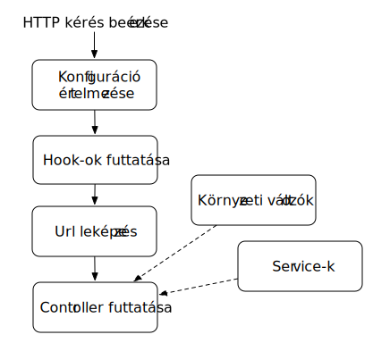
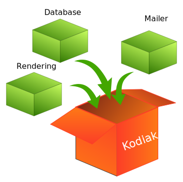

Ilx alapok
===========

A Kodiak működése
------------------

A Kodiak egy egyszerű php nyelven készült web keretrendszer, amelynek segítségével php alkalmazásokat fejleszhetünk MVC
architektúrában. Az alábbiakban egy rövid összefoglalót adunk a Kodiak működéséről, ami szükséges az Ilx helyes
használatához.

A Kodiak egy monolitikus konfigurációban gondolkozik, amely tartalmaz minden szükséges beállítást az alkalmazás
futtatásához. A Kodiak ezt a konfigurációt felhasználva képes futtatni az alkalmazásunkat. A konfigurációs fájl 5 fő
elemet tartalmaz:

 * **Környezeti változók (environment):** Környezeti változónak minősülnek azok a kulcs-érték párok, amelyekre az alkalmazás tetszőleges pontján szükség lehet. Ilyen lehet az időzóna vagy hogy milyen módban futtatjuk az alkalmazást (development, product)
 * **Hook-ok (hooks):** Olyan elemek, amelyeknek minden a webszerver felé indított kérés kezelése előtt le kell futtatni. Tipikusan jó példa erre a session inicializálása vagy annak vizsgálata, hogy a felhasználó jogosult-e egy adott weboldal megnyitására.
 * **Service-ek (services):** Olyan szolgáltatások, amelyekre nincsen szükség minden kérés kezelésénél, de elérésük alkalmazás tetszőleges pontján fontosak. Például ilyen szolgáltatás lehet az email-ek küldése, loggolás, weboldal tartalmának renderelése.
 * **Route-k (routes):** Az alkalmazásból elérhető útvonalak listája, amely minden útvonal esetén tartalmazza, hogy melyik Controller melyik metódusa kezeli az adott útvonalat.
 * **Router (router):** Tartalmazza, hogy milyen módszer alapján történjen az útvonalak leképezése. Ezzel nem kell foglalkozunk.

Ha ezeket az elemeket sikeresen beállítottuk a Kodiak minden egyes HTTP kérés esetén a konfigurációt értelmezve fogja
lekezelni az adott kérést.

A kérés kezelésének a lépései sorrendhelyesen a következők:
 1. A Kodiak betölti az alkalmazás konfigurációt, és beregisztrálja magának a konfigurációban megadott elemeket
 2. Futtatja a definiált Hook-okat a megadott sorrendben. (Például egy Hook létrehozza a php session-t, egy másik ellenőrzi a jogosultságokat, stb.)
 3. Ha a Hook-ok sikeresen lefutottak és valamilyen ok (pl.: jogosultság hiánya) miatt nem kellett leállítani a kérés kezelését a konfigurációban megadott Router segítségével leképezi az Url-t egy Controller - metódus párosra
 4. Meghívja a Router által kiderített Controller megfelelő metódusát, ahol már a fejlesztő által definiált üzleti logika található.
 5. A metódusokban a fejlesztő hozzáfér mind a környezetiváltozókhoz és a Service-khez is.

Példa környezeti változók hozzáféréséhez::

    $timezone = Application::getEnv("timezone")

Példa service hozzáférésre (itt most egy logger szolgáltatásra látsz példát) ::

    $logger = Application::get("logger")

Az Ilx működése
---------------

Az Ilx a Kodiak-re épülő rendszer, amely célja kettős. Egyrészt eltünteti a Kodiak konfiguráció összeállításának
komplexitását. Másrészt felgyorsítja a fejlesztési folyamatot, úgy hogy előre definiált dobozok segítségével a
fejlesztőnek már csak a tényleges üzleti logika megírására kell koncentrálnia.

Ezek alapján az Ilx a fejlesztő számára két fő szolgáltatást biztosít:

 1. Definiál előre elkészített dobozokat, úgynevezett modulokat, amik egy logikailag jól körülhatárolt funkcionalitást valósítanak meg.
 2. Egyszerűen használható szkripteket biztosít a fejlesztők számára, amik a szükséges modulokat egy Kodiak alkalmazásba szervezik.

Az elérhető parancsok listáját a :ref:`commands-label` oldalon találod, míg az Ilx által biztosított modulokról a
:ref:`modules-label`-ban találsz részletes leírást.

Első alkalmazásom
-------------------

Első lépésben le kell tölteni az Ilx-et composer segítségével::

    composer require ilx-hu/ilx-framework

Ha ez megtörtént a vendor/bin könyvtárban már ott lesz az ilx.php, ami az Ilx menedzsment szkriptjeit tartalmazza.
A használható parancsok listáját a :ref:`commands-label` oldalon találod. Ezek közül egy új alkalmazás készítéséhez a
quick-start parancsot lehet használni::

    php vendor/bin/ilx.php quick-start

A parancs futtatása során végighalad azokon a fő elemeken ami szükséges lehet az alkalmazás működéséhez és a megadott
inputok alapján készíti el a modules.json-t. (A modules.json az aktuális working directoryban jön létre.)

A modules.json tartalmazza az összes információt, ami leírja az alkalmazás felépítését. Van-e adatbázis kapcsolat, ha igen
akkor hova kell kapcsolódni, kell-e authentikálni a felhasználókat, ha igen milyen módszerrel. Van-e levelező szerver amit
használni kell, ha igen milyen email sablonok vannak...stb.

Ha a "Generating project templates" kérdésre yes-szel válaszoltunk a modules.json mellett létrehoz egy src mappát, amiben:

* három könyvtár található: Controller, Model, View,
* és [Projectname]Module.php nevű fájl

A három könyvtárban kell helyezni az alkalmazás specifikus részeit, míg a [Projectname]Module.php fájl azt határozza meg, hogy
a három könyvtár tartalmát hogyan kell beilleszteni a Kodiak alkalmazásba. A [Projectname]Module.php beállításáról a
:ref:`custom-module-label` oldalon olvashatsz.

A modules.json-t felhasználva lehet telepíteni az Ilx rendszert az :ref:`install-cmd-label` paranccsal::

    php vendor/bin/ilx.php install modules.json

A telepítés után létrejön:

* egy config könyvtár, amiben a conf.json tartalmazza a Kodiak konfigurációt. Ezt kézzel ne szerkesd, mert az itt végrehajtott változtatások felülíródnak a következő frissítésnél
* egy view könyvtár, ami a használt twig fájlokat tartalmazza.
* egy web könyvtár, ami az index.php-t tartalmazza (alkalmazás belépési pontja).

.. warning::

    Azok a view-k, amiket az src/View-ban definiálunk be vannak linkelve a view/[Projectname] alá (szimbolikus linkkel). Az src/View változásai emiatt automatikusan érvényre jutnak.

Az src/Controller mappában hozzunk létre egy MyController.php fájlt, aminek legyen egy metódusa, ami kiírja, hogy hello world::

    namespace Projectname\Controller;

    class MyController
    {
        public function hello() {

            return "hello world";
        }
    }

Hogy kívülről is hívható legyen, a [Projectname]Module.php route-jainál hozzá kell adni a metódust egy tetszőleges url-hez::

        function routes()
    {
        return [
            [
                "method"    => "GET",
                "url"       => "/home",
                "handler"   => MyController::class."::home",
            ]
        ];
    }

Ahhoz, hogy a változtatások érvényre jussanak egy :ref:`update-cmd-label` parancsot kell futtatnunk::

    php vendor/bin/ilx.php update modules.json

Ezután elindíthatjuk az alkalmazást a beépített php webszerverrel::

    cd web
    php -S 0.0.0.0:8801

